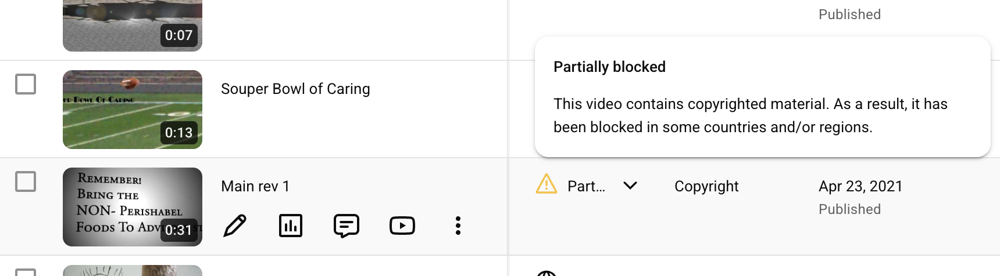
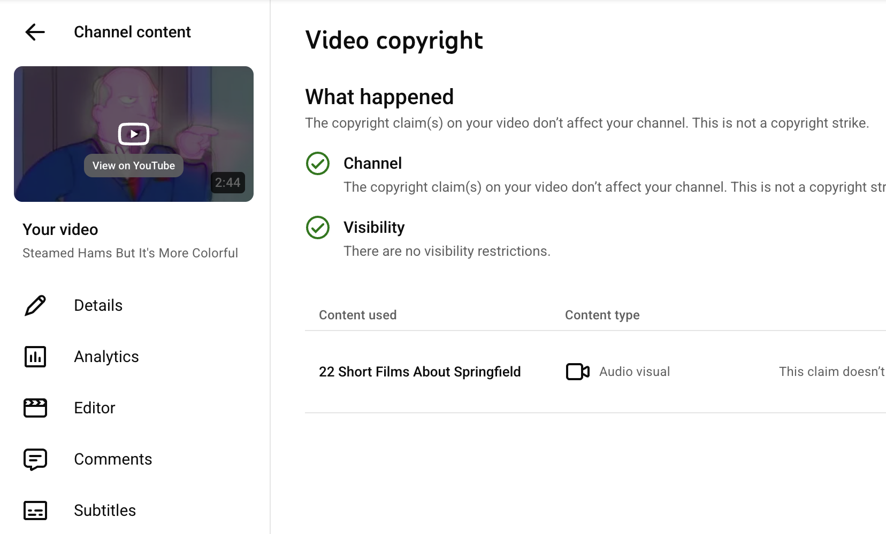

# YouTube

YouTube uses automated methods for detecting copyrighted content as well as manual user reports.

If the content is flagged as potentially infringing then depending on the copyright holder's preferences it either blocks the content or it demonetizes it.

If the content was just flagged you can contest this in your account. If it was fully taken down (counts as a strike) then you have to get lawyers involved. (https://support.google.com/youtube/answer/12104471?hl=en&co=GENIE.Platform%3DDesktop)

If your content was flagged by Content ID then the monetization may be disabled or go to the copyright holder.

# Fair Use

The first upload was a video that used copyrighted music for a school project in middle school: 

The second video is an edited version of "Steamed Hams" from the Simpsons. I guess it can be considered parody but it's pretty low effort. The video was flagged for copyright but it wasn't restricted. 

# AI-Generated Content

I would try harder but I'm super stressed right now so this is all I'm going to complete. Great course, thanks for teaching it!
